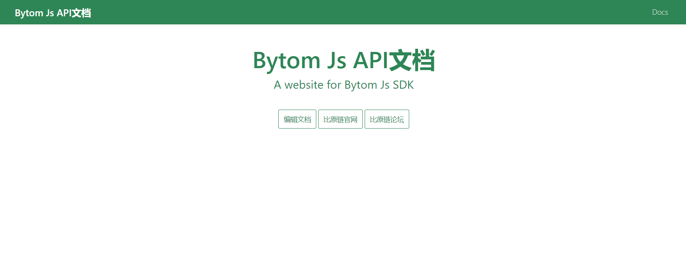

# BytomNode.github.io

此文档介绍了包含[bytom node sdk](<https://github.com/Bytom/bytom-java-sdk>)提供支持的网站配置和文档。

## 入门

### 准备

1. 确保您安装了 [Node](https://nodejs.org/en/download/) （需要8.0或更高的版本）.

   > 如果您没有安装 Node 8.2 + ，或是您希望在全局范围内安装 Docusaurus，请运行 `yarn global add docusaurus-init` 或 `npm install --global docusaurus-init`。 安装完成后，运行 `docusaurus-init`。

2. 我们同样建议您也安装 [Yarn](https://yarnpkg.com/en/docs/install) （需要1.5或更高的版本）.

3. 在github上clone项目到本地文件夹，项目中包含两个文件夹： `docs` and `website`.

   ```bash
   git clone https://github.com/BytomFans/node-docs
   ```

### 安装

在根目下运行：

1. `cd website`进入站点的网页部分.
2. `yarn` 安装网页的依赖库 (或者使用命令 `npm install`).

### 本地运行

1. `使用命令 `yarn start` or `npm start`运行网站.
2. 如果没有自动打开本地的示例网站，请在 [http://localhost:3000](http://localhost:3000/) 访问站点.



### 目录结构

```bash
root-directory
│  .dockerignore
│  .gitignore
│  docker-compose.yml
│  Dockerfile
│  README.md
│
├─.circleci
│      config.yml
│
├─docs
│      0_start.md
│      10_work.md
│      11_message.md
│      12_feed.md
│      13_net-info.md
│      14_decode_program.md
│      15_other.md
│      16_build.md
│      1_key.md
│      2_account.md
│      3_asset.md
│      4_transaction.md
│      5_wallet.md
│      6_access_token.md
│      7_block.md
│      8_mining.md
│      9_gas.md
│
└─website
    │  package.json
    │  sidebars.json
    │  siteConfig.js
    │
    ├─blog
    │      2016-03-11-blog-post.md
    │      2017-04-10-blog-post-two.md
    │      2017-09-25-testing-rss.md
    │      2017-09-26-adding-rss.md
    │      2017-10-24-new-version-1.0.0.md
    │
    ├─core
    │      Footer.js
    │
    ├─pages
    │  └─en
    │          help.js
    │          index.js
    │          users.js
    │
    └─static
        ├─css
        │      custom.css
        │
        └─img
                docusaurus.svg
                oss_logo.png
```


